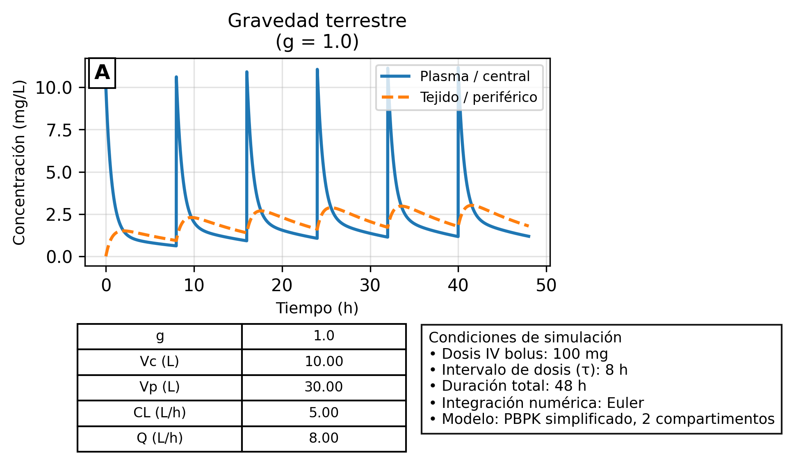
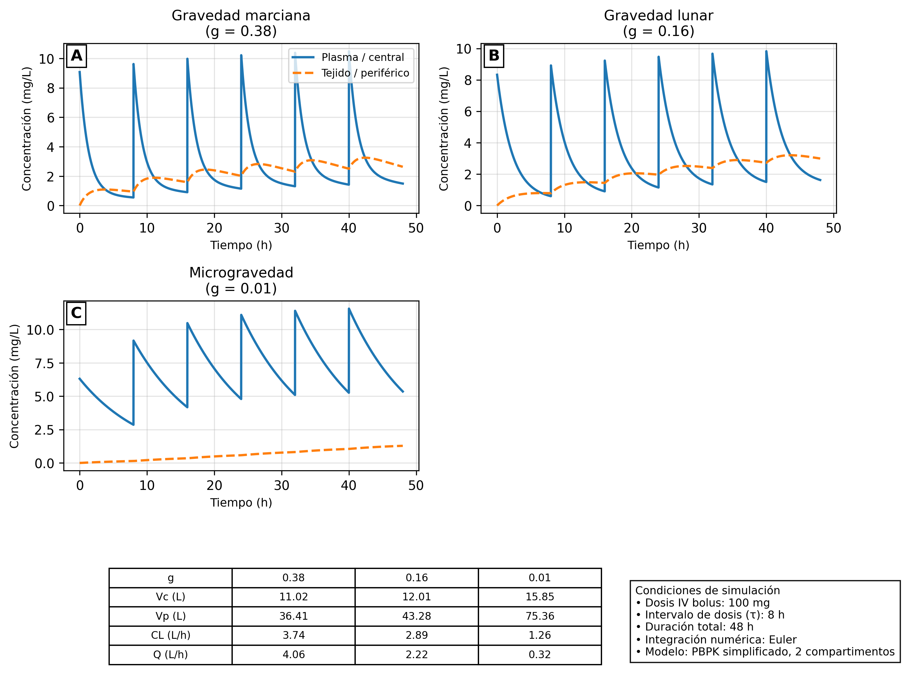
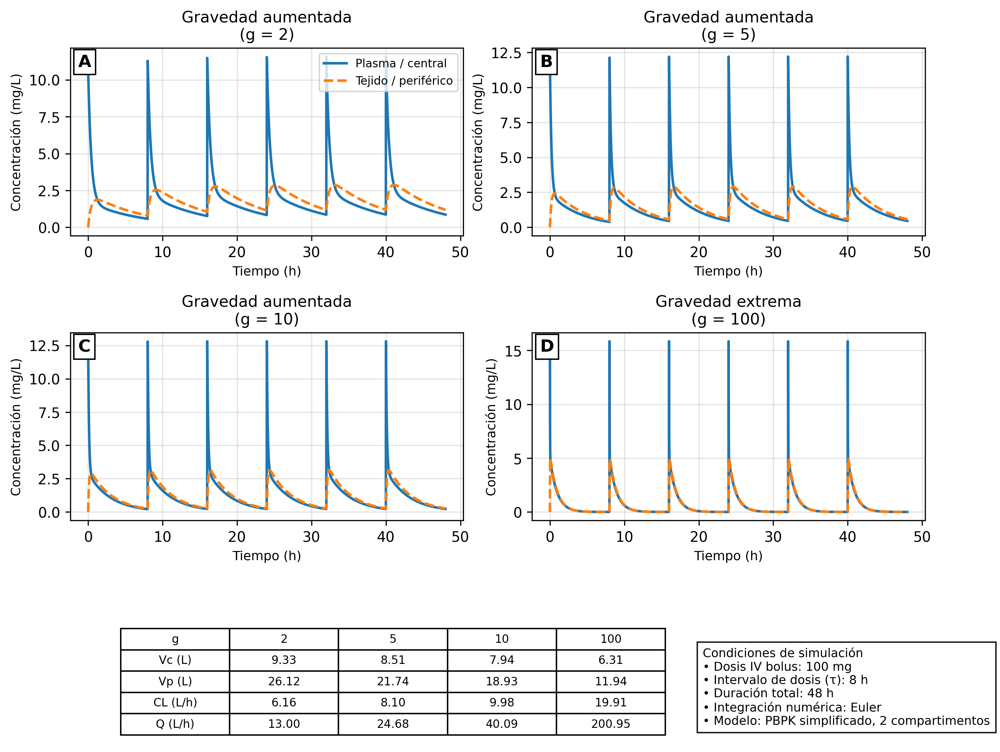

# Gravity-modulated PK/PBPK model

This repository contains an exploratory pharmacokinetic (PK) and physiologically-based pharmacokinetic (PBPK) model under variable gravitational conditions.

---

## 🚀 Key idea

Gravity is introduced as a scaling factor affecting:

- Drug elimination (k10)
- Inter-compartment exchange (k12, k21)
- Distribution volumes

This enables simulation of pharmacokinetics under:

- Microgravity (spaceflight)
- Lunar / Martian gravity
- Hypergravity environments

---

## 📊 Results

### Earth gravity


### Low gravity


### High gravity


---

## 📈 Metrics

- AUC vs gravity
- Tissue/plasma decoupling
- Cmax / trough evolution

---

## 📄 Paper

See: [paper](paper/pbpkspace.pdf)


---

```markdown
---

## ⚙️ Run

Run the simulation with:

```bash
pip install -r requirements.txt
python scripts/run_simulation.py


🧠 Author

Daniel Jiménez Valencia
April 2026

⚠️ Disclaimer

This is an exploratory computational model intended for hypothesis generation.
It does not represent validated clinical pharmacokinetic predictions.
=======


